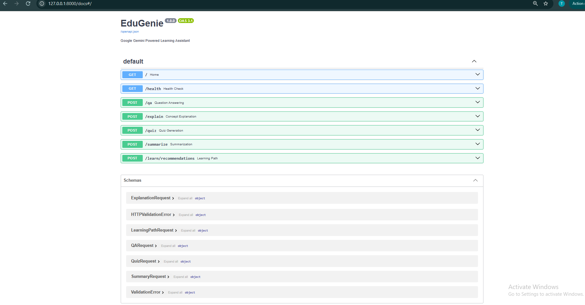

# 05 — Backend API with FastAPI

## Objective

Build the backend API using FastAPI and provide endpoints for the core EduGenie learning features.

## Backend Framework

EduGenie uses FastAPI as the backend framework.

FastAPI connects the web interface with the individual AI-powered learning modules.

## Implemented API Endpoints

### 1. Question and Answer

**Endpoint:** `POST /qa`

Connects the user question to the Question and Answer module and returns the generated answer.

### 2. Concept Explanation

**Endpoint:** `POST /explain`

Connects the requested concept to the local Concept Explanation module and returns the generated explanation.

### 3. Quiz Generation

**Endpoint:** `POST /quiz`

Accepts the topic, number of questions, and difficulty level and returns the generated quiz.

### 4. Content Summarization

**Endpoint:** `POST /summarize`

Accepts educational content and the requested summary length and returns the generated summary.

### 5. Personalized Learning Path

**Endpoint:** `POST /learn/recommendations`

Accepts the subject, current level, learning goal, available time, and duration and returns a personalized learning path.

## Backend Structure

The main FastAPI application is implemented in:

`main.py`

The backend imports and connects the five feature modules:

- `qna.py`
- `explanation_module.py`
- `quiz_module.py`
- `summary_module.py`
- `learning_path.py`

## API Validation

FastAPI request models are used to validate incoming data before it is passed to the corresponding service module.

The backend also handles validation errors and service errors using appropriate HTTP responses.

## Evidence

The complete FastAPI backend implementation is available in:

`main.py`

The five API endpoints are connected to their corresponding AI service modules.

## Screenshot Evidence

The FastAPI Swagger documentation page was captured to verify the implemented backend API endpoints.

The screenshot shows the available EduGenie routes, including the five main learning feature endpoints:

- `POST /qa`
- `POST /explain`
- `POST /quiz`
- `POST /summarize`
- `POST /learn/recommendations`

It also shows the supporting:

- `GET /`
- `GET /health`

## Verification

The FastAPI application was successfully started using Uvicorn and the backend endpoints were integrated with the EduGenie web interface.

## Status

**Completed**