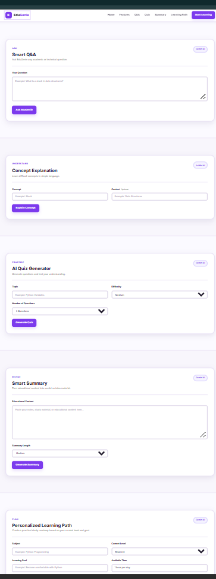

# 06 — Frontend Interface

## Objective

Build the web interface for EduGenie and provide a simple interface through which learners can access the application's AI-powered learning features.

## Frontend Technologies

The EduGenie frontend uses:

- HTML
- CSS
- JavaScript
- Jinja2 templates

## Web Interface

The main frontend page is:

`templates/index.html`

The interface provides access to the five major learning features:

- Question and Answer
- Concept Explanation
- Quiz Generation
- Content Summarization
- Personalized Learning Path

## Styling

The frontend styling is implemented in:

`static/style.css`

The stylesheet provides the layout, forms, cards, buttons, results sections, responsive design, and visual presentation of the application.

## User Interaction

The interface provides forms and controls through which users can:

- Enter questions
- Enter concepts for explanation
- Configure quizzes
- Submit content for summarization
- Provide learning preferences for a personalized learning path

The generated results are displayed directly in the web interface.

## Evidence

The frontend implementation is available in:

- `templates/index.html`
- `static/style.css`

## Screenshot Evidence

The completed EduGenie frontend interface was captured to provide visual proof of the implemented web interface.

The screenshot shows the main EduGenie learning interface with the five major learning features:

- Question and Answer
- Concept Explanation
- Quiz Generation
- Content Summarization
- Personalized Learning Path

## Verification

The EduGenie web interface was successfully loaded through the FastAPI application and the frontend was connected to the implemented learning features.

## Status

## Status

**Completed**