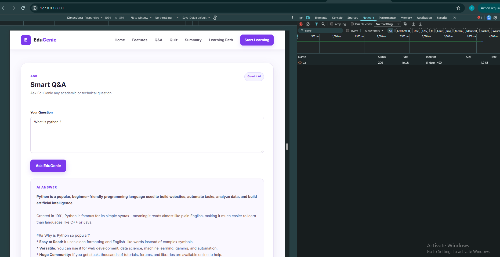

# 07 — Live Integration

## Objective

Integrate the EduGenie frontend with the FastAPI backend so that user inputs are sent to the appropriate API endpoint and the generated results are displayed in the web interface.

## Frontend-Backend Integration

The frontend uses JavaScript `fetch()` requests to communicate with the FastAPI backend.

The following API endpoints are connected to the corresponding frontend features:

- `POST /qa` — Question and Answer
- `POST /explain` — Concept Explanation
- `POST /quiz` — Quiz Generation
- `POST /summarize` — Content Summarization
- `POST /learn/recommendations` — Personalized Learning Path

## Request Flow

User Input
↓
Frontend Form
↓
JavaScript fetch() Request
↓
FastAPI Endpoint
↓
AI Module
↓
Generated Result
↓
Frontend Result Section

## Implementation

The frontend integration is implemented in:

`templates/index.html`

The FastAPI endpoints are implemented in:

`main.py`

The backend endpoints call the corresponding AI modules and return the generated results to the frontend.

## Evidence

The frontend contains API requests for the implemented EduGenie features, while `main.py` provides the corresponding FastAPI endpoints.

## Verification

The frontend and backend were successfully integrated and the application was accessed through the FastAPI server.

User requests were sent from the web interface to the backend, and generated results were returned and displayed in the interface.

## Screenshot Evidence

The live frontend-backend integration was verified using the EduGenie Question and Answer feature.

The screenshot provides two pieces of evidence in a single capture:

- The user submitted a question through the EduGenie frontend and received a generated AI answer.
- The Chrome Network tab shows the `qa` request with a `200` status, confirming a successful frontend-to-backend API request.

The screenshot demonstrates the live request flow:

User Input
↓
EduGenie Frontend
↓
`POST /qa`
↓
FastAPI Backend
↓
Gemini AI
↓
Generated Answer
↓
Frontend Display

## Verification

The frontend and backend were successfully integrated and the application was accessed through the FastAPI server.

The Question and Answer feature successfully sent a request to the backend and displayed the generated response in the frontend.

## Status

**Completed**