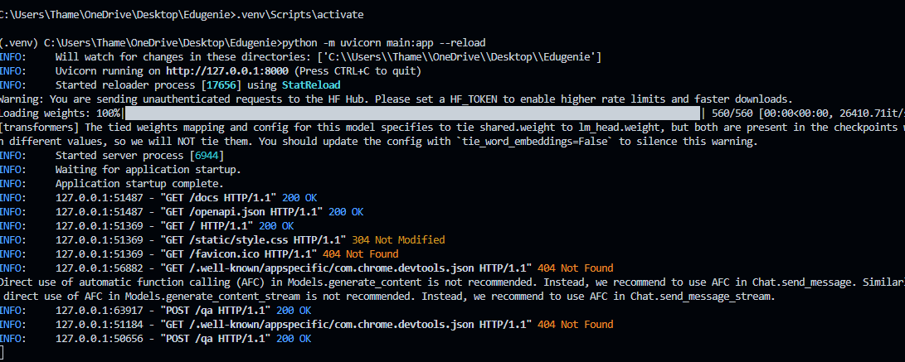

# 08 — Run Locally

## Objective

Run the EduGenie application locally and verify that the FastAPI server, frontend, static files, and AI-powered features are accessible through the local development environment.

## Local Environment

EduGenie was developed and tested using:

- Python 3.12.0
- Python virtual environment
- FastAPI
- Uvicorn
- Jinja2
- Google Gemini API
- Transformers
- PyTorch

## Installation

Install the project dependencies listed in:

`requirements.txt`

The Gemini API key is configured locally through the `.env` file.

## Start the Application

Activate the project virtual environment and run the FastAPI application using:

`python -m uvicorn main:app --reload`

## Local Application URL

After the server starts successfully, access EduGenie at:

`http://127.0.0.1:8000/`

## Local Server

Uvicorn runs the FastAPI application and serves:

- The EduGenie web interface
- Static CSS files
- Backend API endpoints
- AI-powered learning features
## Screenshot Evidence

The EduGenie application was successfully started in the local development environment using Uvicorn.

The screenshot shows:

- The Python virtual environment is active.
- The FastAPI application was started using Uvicorn.
- Uvicorn is running on `http://127.0.0.1:8000`.
- The application startup completed successfully.

## Verification

The EduGenie application was successfully started using Uvicorn and accessed through the local browser at `http://127.0.0.1:8000/`.

The frontend, static styling, backend API, and AI-powered features were successfully accessible in the local environment.

## Status

**Completed**