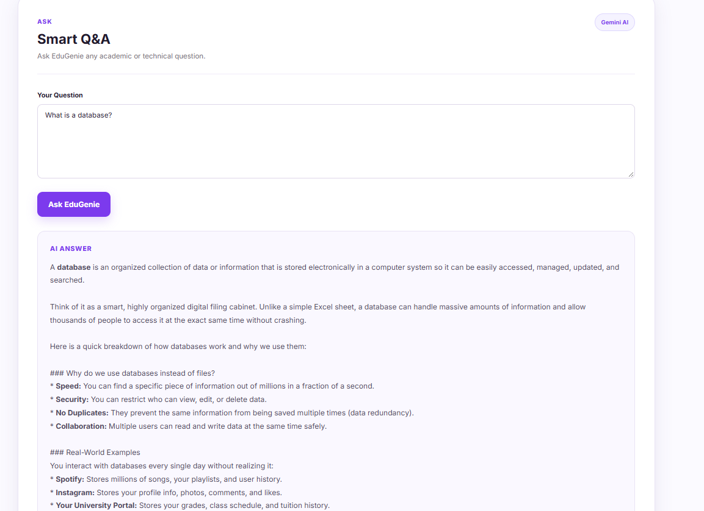
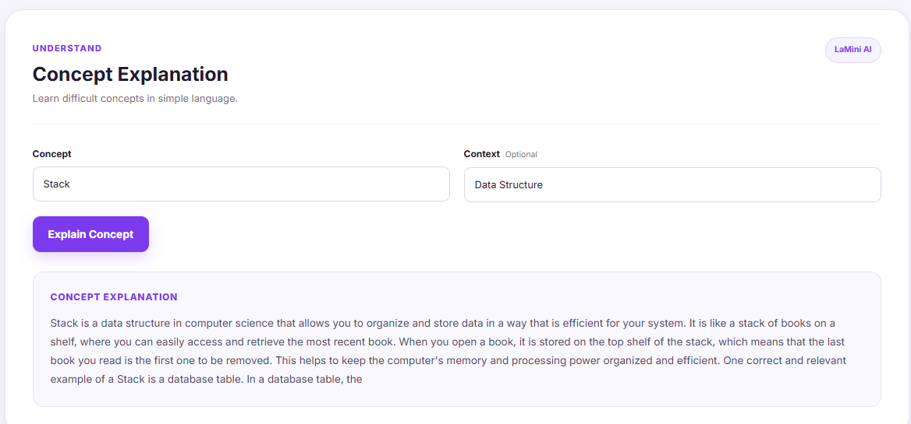
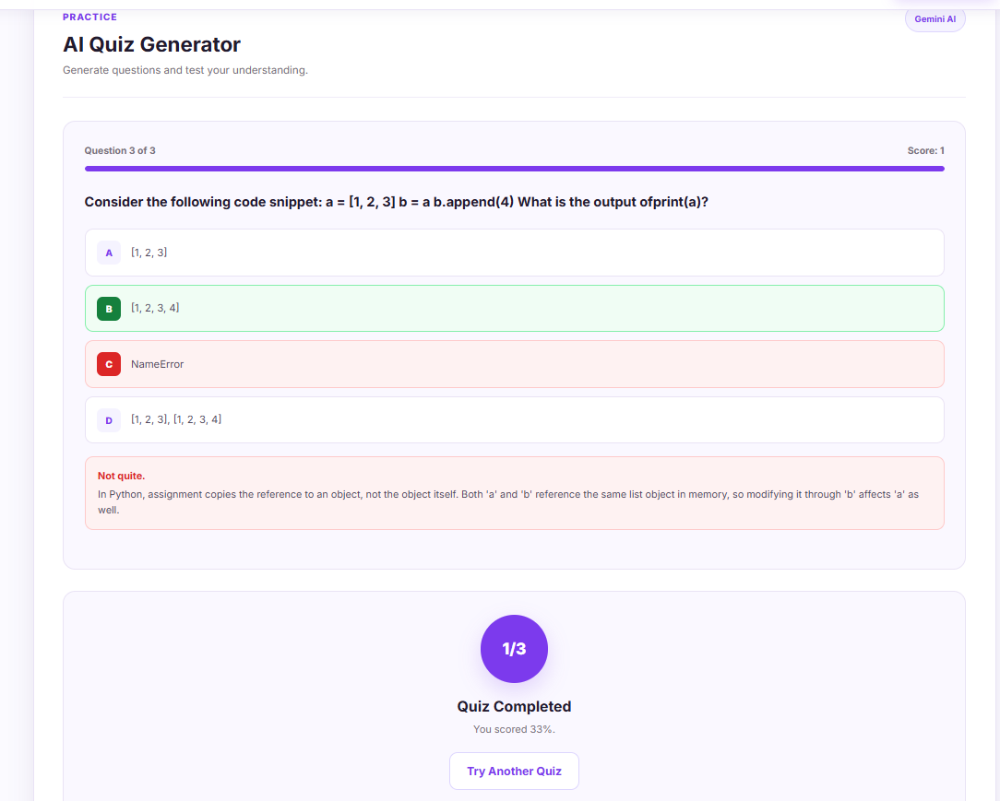
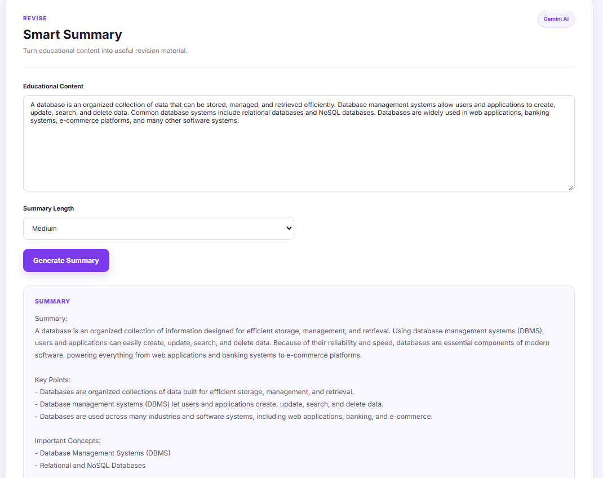
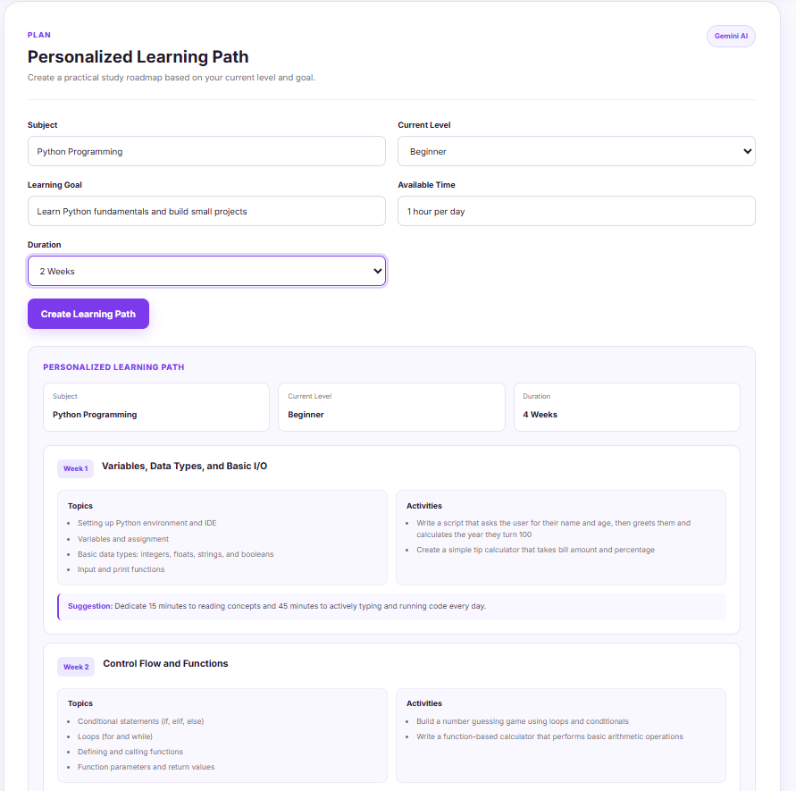

# 09 — Functional Testing

## Objective

Verify that the major EduGenie learning features work correctly after integrating the AI modules, FastAPI backend, and frontend interface.

## Testing Environment

Functional testing was performed in the local development environment using:

- Python 3.12.0
- FastAPI
- Uvicorn
- Google Gemini API
- LaMini-Flan-T5-783M
- HTML
- CSS
- JavaScript
- Google Chrome

## Features Tested

The following EduGenie features were tested through the web interface.

### 1. Question and Answer

A user question was entered through the Question and Answer interface.

The request was sent to the FastAPI `/qa` endpoint and processed using Gemini 3.5 Flash-Lite.

The generated answer was successfully displayed in the frontend.

**Test Input:** `What is a database?`

**Result:** Passed

#### Screenshot Evidence

The screenshot shows the submitted question and the generated AI answer displayed in the EduGenie frontend.

### 2. Concept Explanation

A computer science concept was entered through the Concept Explanation interface.

The request was sent to the FastAPI `/explain` endpoint and processed using the local LaMini-Flan-T5-783M model.

The generated explanation was successfully displayed in the frontend.

**Test Input:**

- Concept: `Stack`
- Context: `Data Structure`

**Result:** Passed

#### Screenshot Evidence

The screenshot shows the selected concept, context, and generated explanation.

### 3. Quiz Generation

A topic, number of questions, and difficulty level were provided through the Quiz interface.

The request was sent to the FastAPI `/quiz` endpoint and processed using Gemini 3.5 Flash-Lite.

The quiz questions and options were successfully generated and displayed in the frontend.

The quiz interface also supports selecting answers, checking answers, receiving feedback, and moving through the generated questions.

**Test Input:**

- Topic: `Python Variables`
- Number of Questions: `3`
- Difficulty: `Medium`

**Result:** Passed

#### Screenshot Evidence

The screenshot shows a generated quiz question, answer options, selected answer, feedback, and the completed quiz result.

### 4. Content Summarization

Educational content was entered through the Summarization interface.

The request was sent to the FastAPI `/summarize` endpoint and processed using Gemini 3.5 Flash-Lite.

The generated summary was successfully displayed according to the selected summary length.

**Test Input:**

- Topic: Database
- Summary Length: `Medium`

**Result:** Passed

#### Screenshot Evidence

The screenshot shows the educational content, selected summary length, and generated summary with key points.

### 5. Personalized Learning Path

The subject, current level, learning goal, available time, and learning duration were provided through the Learning Path interface.

The request was sent to the FastAPI `/learn/recommendations` endpoint and processed using Gemini 3.5 Flash-Lite.

The generated personalized learning plan was successfully displayed in the frontend.

**Test Input:**

- Subject: `Python Programming`
- Current Level: `Beginner`
- Learning Goal: `Learn Python fundamentals and build small projects`
- Available Time: `1 hour per day`
- Duration: `4 weeks`

**Result:** Passed

#### Screenshot Evidence

The screenshot shows the entered learning preferences and the generated multi-week personalized learning plan.

## Functional Test Summary

| Feature                    | Backend Endpoint              | AI Model              | Result |
| -------------------------- | ----------------------------- | --------------------- | ------ |
| Question and Answer        | `POST /qa`                    | Gemini 3.5 Flash-Lite | Passed |
| Concept Explanation        | `POST /explain`               | LaMini-Flan-T5-783M   | Passed |
| Quiz Generation            | `POST /quiz`                  | Gemini 3.5 Flash-Lite | Passed |
| Content Summarization      | `POST /summarize`             | Gemini 3.5 Flash-Lite | Passed |
| Personalized Learning Path | `POST /learn/recommendations` | Gemini 3.5 Flash-Lite | Passed |

## Integration Verification

The functional testing confirmed that the main EduGenie components work together as expected:

User Input
↓
Frontend Interface
↓
FastAPI Backend
↓
Feature Module
↓
Assigned AI Model
↓
Generated Result
↓
Frontend Display

## Overall Testing Result

All five major EduGenie learning features were successfully tested through the local web application.

The frontend, backend API endpoints, AI modules, and result display were verified as functioning together.

## Status

**Completed**
